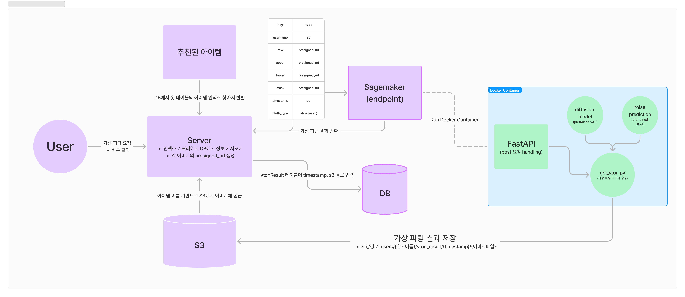

# Omoib Virtual Try-On

## **공지 / Notice**
**이 레포지토리는 Python 3.9, CUDA 11.8에서 검증되었습니다.**  
**This repository has been validated with Python 3.9 and CUDA 11.8.**

## **이 레포지토리의 목적 / Purpose of this Repository**
이 레포지토리는 **AWS SageMaker**에서 추론을 수행하기 위한 **커스텀 도커 컨테이너 구축**에 최적화되어 있습니다.  
This repository is optimized for building **custom Docker containers** to perform inference on **AWS SageMaker**.

## **각 파일의 역할 / Role of Each File**
1. **`vton_api.py`**  
   - 커스텀 컨테이너로 들어오는 HTTP 요청의 진입점을 제공합니다.  
   - FastAPI로 작성된 작은 서버로 `/ping` 및 `/invocations` 엔드포인트를 포함합니다.  
   Provides an entry point for HTTP requests coming into the custom container.  
   It is a small server written in FastAPI and includes the `/ping` and `/invocations` endpoints.

2. **`get_vton.py`**  
   - 필요한 파라미터를 받아 VTON 인퍼런스를 수행합니다.  
   - `model/` 디렉토리의 `pipeline.py`에서 추론 관련 세부 사항을 정의하고, 이 파일에서는 전처리, 큐잉, S3 업로드 작업을 처리합니다.  
   Performs VTON inference by taking the required parameters.  
   The inference details are defined in `pipeline.py` under the `model/` directory, while this file handles preprocessing, queuing, and S3 uploads.

## **Dockerfile 주요 구조 / Key Structure of the Dockerfile**
1. 우분투 20.04 및 CUDA 11.8 전용 베이스 이미지 사용  
   Using a base image specifically for Ubuntu 20.04 and CUDA 11.8.  
2. 인터랙션 비활성화 및 타임존을 서울로 고정  
   Disabling interactions and setting the timezone to Seoul.  
3. Python 3.9 설치  
   Installing Python 3.9.  
4. CUDA 11.8에 맞는 PyTorch 설치  
   Installing PyTorch compatible with CUDA 11.8.  
5. 필요한 패키지 설치  
   Installing required packages.  
6. FastAPI 서버 실행  
   Running the FastAPI server.  

## **로컬 환경에서 추론 실행 방법 / How to Run Inference Locally**
1. **`get_vton.py`** 파일을 엽니다.  
   Open the **`get_vton.py`** file.  
2. `if __name__ == "__main__":` 아래에 정의된 URL들을 적절히 수정합니다.  
   Modify the URLs defined under `if __name__ == "__main__":` as necessary.  
3. 기타 파라미터는 그대로 사용하셔도 됩니다.  
   Other parameters can remain as is.
4. 실행 결과는 `./vton_output`에 저장됩니다.  
    The result will be saved in `./vton_output`

**참고 / Note:**  
- 현재는 `cloth_type`이 `overall`일 때 최적화되어 있습니다.  
  **Currently optimized for `cloth_type=overall`.**  
- 이 경우 상의와 하의를 모두 입력해야 정상적으로 피팅이 됩니다.  
  **Both top and bottom must be provided for proper fitting.**  
- `mask_image_url` 관련 마스크 이미지 생성 작업은 아래 링크의 지침을 참고하세요:  
  **Refer to the following instructions for generating mask images related to `mask_image_url`:**  
  <a href="https://github.com/git-hubsalt/generate-mask" target="_blank">Generate Mask Instructions</a>
 

- **`vton_api.py`**로 FastAPI 서버를 테스트할 때 동일한 입력 방식을 사용하면 됩니다.  
  Use the same inputs when testing the FastAPI server in **`vton_api.py`**.

**추론 속도 & 성능 개선을 위한 제언 / Suggestions for Improving Inference Speed & Performance:**
- 더 훌륭한 결과물을 위해서는 사용자 이미지의 너비와 높이를 768X1024로 맞추기를 권장드립니다.  
  We recommend setting the user's image width and height to 768x1024 for better results.  
- CatVTONPipeline에서 weight_dtype은 퀀타이제이션과 관련있습니다. torch.float32는 추론 속도가 더 느려집니다.  
  In CatVTONPipeline, weight_dtype is related to quantization. Using torch.float32 results in slower inference speeds.
- GPU가 Ampere 아키텍처 이상이라면 use_tf32를 True로 하기를 권장드립니다. 추론 속도가 급격히 빨라지지만 그만큼 VRAM을 더 많이 잡아먹습니다. (CUDA OOM 발생 가능성 높음)  
  If your GPU is of Ampere architecture or newer, we recommend setting use_tf32 to True. This significantly speeds up inference but increases VRAM usage (higher chance of CUDA Out-Of-Memory errors).
- CatVTON 관련 더 자세한 설명은 아래 CatVTON 레포지토리를 참고하세요:  
  For more detailed information about CatVTON, please refer to the repository below:  
  <a href="https://github.com/Zheng-Chong/CatVTON?tab=readme-ov-file" target="_blank">CatVTON GitHub Repository</a>

## **워크플로우 / Workflow**

> 1️⃣ **회원가입 시 등록한 user image에서 상의와 하의를 마스킹한 이미지를 생성**  
Generate masked images for tops and bottoms from the user's registered image.  
2️⃣ **상의와 하의를 모두 피팅해야 하는 경우, item image를 연결하여 한번에 처리**  
Concatenate item images for tops and bottoms to perform fitting simultaneously.  
3️⃣ **user image, masking image, item image를 CatVTON 모델에 입력하여 피팅된 이미지 반환**  
Input the user image, masking image, and item image into the CatVTON model to generate the fitted image.  

## **추론 결과 / Inference Result**
